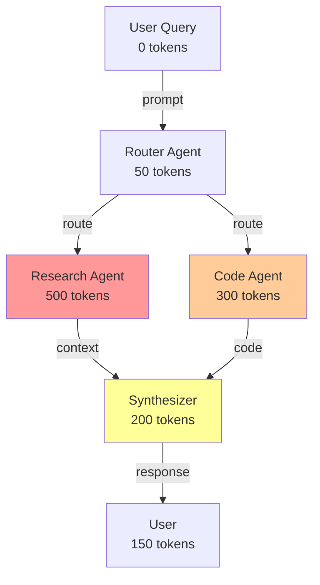

# Building Token Monitoring Frameworks for LLM Agent Systems

**The most effective approach combines decorator-based instrumentation with hierarchical span tracking and OpenTelemetry standards.** Production systems should use existing platforms like Langfuse or LangSmith for comprehensive observability while custom implementations can leverage decorator patterns for lightweight, node-based monitoring. The key challenge isn't just counting tokens—it's accurately tracking them across nested agent calls, aggregating metrics across complex graph topologies, and visualizing consumption patterns to enable optimization.

This research synthesizes academic papers, practical implementations, design patterns, existing tools, and advanced techniques to provide a complete guide for building or selecting token monitoring solutions for LLM agent systems.

## The monitoring landscape has matured rapidly

The LLM observability space evolved from basic logging to sophisticated distributed tracing systems in just 18 months. **Research shows three viable architectural approaches**: callback-based frameworks (LangChain/LlamaIndex), OpenTelemetry-based instrumentation (Langfuse, Phoenix, OpenLLMetry), and API gateway proxies (Helicone). Academic work from 2024-2025 identifies observability as critical for AI safety, with frameworks like AgentOps and LumiMAS achieving 97% accuracy in anomaly detection with under 3% performance overhead.

The convergence on OpenTelemetry as an industry standard enables vendor-neutral instrumentation while specialized tools provide LLM-specific features. Most production systems now track not just basic token counts but also cached tokens, reasoning tokens (for models like o1), audio/image tokens for multimodal systems, and real-time cost attribution.

## Academic foundations provide rigorous frameworks

Recent academic research establishes comprehensive observability taxonomies for LLM agents. **The AgentOps framework (arXiv:2411.05285)** presents the most complete taxonomy, analyzing 17 commercial and open-source tools to identify key artifacts: goals, plans, tools, LLM interactions, and agent-specific data. This work establishes session-level tracking with unique session IDs, hierarchical trace structures with parent-child span relationships, and standardized metrics including token usage, cost, latency, errors, and throughput.

**LumiMAS (arXiv:2508.12412)** demonstrates production-ready monitoring with three-layer architecture: platform-agnostic event logging, LSTM-based anomaly detection, and LLM-based explanation. The system achieves real-time detection under 0.07 seconds and tracks execution performance indicators including token counts (prompt, completion, total), execution duration, and tool usage patterns. Tested across CrewAI and LangGraph platforms, it shows 97% accuracy on indirect prompt injection detection.

**AgentSight (arXiv:2508.02736)** introduces boundary tracing using eBPF for framework-agnostic monitoring at the system level, achieving less than 3% overhead. This approach intercepts TLS-encrypted traffic to extract semantic intent while monitoring kernel events, providing observability without code modification. The Task Memory Engine (arXiv:2505.19436) demonstrates 19.4% token savings through structured DAG-based task tracking, eliminating hallucinations in multi-step scenarios.

**Token-Budget-Aware LLM Reasoning (arXiv:2412.18547)** addresses cost optimization, achieving 68.64% token reduction with less than 5% accuracy loss through dynamic budget estimation and binary search strategies. The Language Agents as Optimizable Graphs framework (arXiv:2402.16823) describes agents as computational graphs where nodes process multimodal data and edges represent information flow, enabling automatic optimization of both node-level prompts and agent orchestration.

## Practical implementations reveal proven patterns

Real-world implementations converge on four core patterns for token monitoring. **The decorator pattern dominates** for its non-invasive instrumentation, composability, and clean separation of concerns. Medium articles and technical blogs show consistent adoption of Python decorators wrapping LLM calls:

```python
from functools import wraps
import time

def token_tracker(func):
    @wraps(func)
    async def wrapper(*args, **kwargs):
        start_time = time.time()
        result = await func(*args, **kwargs)
        
        # Extract token usage from result
        usage_event = {
            "timestamp": int(start_time * 1000),
            "prompt_tokens": getattr(result, "prompt_tokens", 0),
            "completion_tokens": getattr(result, "completion_tokens", 0),
            "total_tokens": getattr(result, "total_tokens", 0),
            "duration": time.time() - start_time
        }
        await log_llm_usage(usage_event)
        return result
    return wrapper
```

**LangChain's native callback system** provides automatic token tracking with minimal code. The UsageMetadataCallbackHandler aggregates tokens across complex chains and agents:

```python
from langchain_core.callbacks import get_usage_metadata_callback

with get_usage_metadata_callback() as cb:
    result = llm.invoke("Tell me a joke")
    print(f"Total Tokens: {cb.usage_metadata.total_tokens}")
    print(f"Prompt Tokens: {cb.usage_metadata.input_tokens}")
    print(f"Completion Tokens: {cb.usage_metadata.output_tokens}")
```

For OpenAI specifically, cost estimation integrates directly:

```python
from langchain_community.callbacks import get_openai_callback

with get_openai_callback() as cb:
    result = llm.invoke("Tell me a joke")
    print(f"Total Cost (USD): ${cb.total_cost}")
```

**LlamaIndex migrated to callback-based systems** with TokenCountingHandler providing separate tracking for embedding versus LLM tokens:

```python
import tiktoken
from llama_index.core.callbacks import CallbackManager, TokenCountingHandler
from llama_index.core import Settings

token_counter = TokenCountingHandler(
    tokenizer=tiktoken.encoding_for_model("gpt-3.5-turbo").encode,
    verbose=False
)

Settings.callback_manager = CallbackManager([token_counter])

# Track both embedding and LLM tokens separately
index = VectorStoreIndex.from_documents(documents)
print(f"Embedding Tokens: {token_counter.total_embedding_token_count}")

response = index.as_query_engine().query("What did the author do?")
print(f"LLM Tokens: {token_counter.prompt_llm_token_count + token_counter.completion_llm_token_count}")
```

**OpenTelemetry integration** provides vendor-neutral instrumentation across frameworks. The OpenLLMetry library and OpenLIT framework enable automatic tracking:

```python
from openinference.instrumentation.openai import OpenAIInstrumentor
from opentelemetry import trace

# Automatic instrumentation
OpenAIInstrumentor().instrument()

# Manual spans for custom operations
tracer = trace.get_tracer(__name__)

@tracer.start_as_current_span("custom_operation")
def my_agent_function():
    # Automatically tracked
    result = openai_client.completions.create(...)
    return result
```

Datadog's hierarchical span decoration shows production-grade implementation:

```python
from ddtrace.llmobs.decorators import llm, workflow, task

@llm(model_provider="openai")
def classify_intent(user_prompt):
    completion = client.chat.completions.create(...)
    return completion

@workflow
def plan(user_prompt):
    intent = classify_intent(user_prompt)
    # Additional logic
    return process(intent)
```

## Design patterns enable robust architectures

Five fundamental patterns form the foundation of effective monitoring systems, each addressing specific challenges in tracking token consumption across agent topologies.

### Decorator pattern provides non-invasive instrumentation

The decorator pattern excels at wrapping individual functions without modifying core logic. **Class-based decorators maintain state** across calls, enabling cumulative tracking:

```python
class TokenCountDecorator:
    def __init__(self, func):
        functools.update_wrapper(self, func)
        self.func = func
        self.total_tokens = 0
        self.call_count = 0
    
    def __call__(self, *args, **kwargs):
        self.call_count += 1
        result = self.func(*args, **kwargs)
        
        tokens_used = extract_token_count(result)
        self.total_tokens += tokens_used
        
        return result

@TokenCountDecorator
def generate_text(prompt):
    return llm.generate(prompt)
```

The pattern supports composability—stack multiple decorators for layered monitoring (token counting, latency measurement, error handling, caching). Use `@functools.wraps` to preserve original function metadata for proper introspection and debugging.

### Proxy pattern enables transparent interception

The proxy pattern wraps LLM clients to intercept all method calls, adding monitoring without changing client code:

```python
class LLMProxy:
    def __init__(self, llm_client, monitor):
        self._client = llm_client
        self._monitor = monitor
    
    def __getattr__(self, name):
        attr = getattr(self._client, name)
        
        if callable(attr):
            def monitored_method(*args, **kwargs):
                self._monitor.before_call(name, args, kwargs)
                
                try:
                    result = attr(*args, **kwargs)
                    self._monitor.after_call(name, result)
                    return result
                except Exception as e:
                    self._monitor.on_error(name, e)
                    raise
            
            return monitored_method
        return attr
```

This pattern suits scenarios requiring lifecycle management, access control, or caching. Helicone's API gateway approach exemplifies proxy-based monitoring, adding ~10ms overhead while providing caching, rate limiting, and observability through a single baseURL change.

### Context managers guarantee cleanup

Context managers ensure monitoring code executes even during errors, making them ideal for operation lifecycle tracking:

```python
from contextlib import contextmanager

@contextmanager
def monitor_llm_execution(operation_name, tracker):
    start_time = time.time()
    tracker.start_operation(operation_name)
    
    try:
        yield tracker
    except Exception as e:
        tracker.record_error(operation_name, e)
        raise
    finally:
        duration = time.time() - start_time
        tracker.end_operation(operation_name, duration)

# Usage
with monitor_llm_execution("text_generation", token_tracker) as tracker:
    response = llm.generate(prompt)
    tracker.record_tokens(response.token_count)
```

The pattern excels at managing hierarchical spans in distributed tracing, with nested context managers representing parent-child operation relationships.

### Middleware pattern enables composable pipelines

Middleware chains provide ordered processing where each layer adds specific functionality:

```python
class MiddlewareChain:
    def __init__(self):
        self.middlewares = []
    
    def use(self, middleware):
        self.middlewares.append(middleware)
    
    def execute(self, context, handler):
        def compose(index):
            if index >= len(self.middlewares):
                return handler(context)
            
            middleware = self.middlewares[index]
            return middleware(context, lambda ctx: compose(index + 1))
        
        return compose(0)

# Example middleware
def token_tracking_middleware(context, next_handler):
    start_tokens = get_token_count()
    result = next_handler(context)
    end_tokens = get_token_count()
    
    context['tokens_used'] = end_tokens - start_tokens
    return result

def cost_calculation_middleware(context, next_handler):
    result = next_handler(context)
    
    if 'tokens_used' in context:
        context['cost'] = calculate_cost(
            context['tokens_used'], 
            context['model']
        )
    return result
```

Each middleware handles one concern (logging, metrics, auth, rate limiting), enabling modular composition. Design middleware to be order-independent when possible, though cost calculation naturally depends on token tracking.

### Node-based architectures track graph topology

Graph-based monitoring maintains the full call topology for agent systems. Three architectural patterns suit different scales:

**Centralized monitoring** uses a single aggregation point collecting metrics from all nodes. Simple to implement with consistent views, but creates potential bottlenecks and single points of failure. Suitable for small-to-medium deployments.

**Decentralized monitoring** distributes collection across nodes with peer-to-peer sharing. Eliminates single points of failure and scales horizontally, but introduces eventual consistency challenges and complex global view reconstruction. Best for large-scale distributed systems.

**Hierarchical monitoring** balances both approaches with regional aggregators feeding a central system. Provides fault tolerance while maintaining reasonable consistency, at the cost of increased architectural complexity.

Implementation requires careful node identification and parent-child relationship tracking:

```python
class GraphNodeMonitor:
    def __init__(self, node_id, parent_id=None):
        self.node_id = node_id
        self.parent_id = parent_id
        self.children = []
        self.metrics = {}
    
    def enter(self):
        self.start_time = time.time()
        if self.parent_id:
            parent_node.children.append(self.node_id)
    
    def exit(self):
        self.metrics['duration'] = time.time() - self.start_time
        # Aggregate children metrics
        self.metrics['total_tokens'] = sum(
            child.metrics.get('tokens', 0) for child in self.children
        )
```

## Existing tools provide production-ready solutions

The ecosystem offers mature platforms spanning open-source libraries to commercial SaaS, each with distinct strengths for different use cases.

### Langfuse leads open-source observability

**Langfuse** (MIT licensed) provides the most comprehensive open-source LLM observability platform with 78+ features. It tracks token usage through two modes: ingestion (direct from LLM responses for accuracy) and inference (using tokenizers when counts unavailable). The platform supports all token types including cached, audio, image, and reasoning tokens with automatic OpenAI/Anthropic tokenizer integration.

Architecture centers on traces containing hierarchical observations (spans, generations, events). Async logging prevents blocking with queued batch processing. The platform acts as an OpenTelemetry backend accepting OTLP traces while providing native Python and JavaScript SDKs. Self-hosting via Docker/Kubernetes or managed cloud options suit different deployment needs.

Token costs calculate at ingestion using model pricing definitions with regex pattern matching. The Daily Metrics API provides aggregated usage and cost by user, tags, and application type. The system integrates with 50+ frameworks including LangChain, LlamaIndex, and LiteLLM.

**Strengths**: Battle-tested in production, comprehensive feature set, strong community (most popular open-source LLMOps platform by GitHub stars and PyPI downloads), excellent documentation, native SDKs, prompt management integrated, user and session tracking built-in.

**Limitations**: Cloud free tier limits to 50k events/month with 30-day retention; self-hosting requires infrastructure management; no cost inference for reasoning models without explicit tokens.

### LangSmith dominates the LangChain ecosystem

**LangSmith** (commercial SaaS with free tier) provides first-class integration with LangChain and LangGraph. Automatic token counting works for OpenAI, Anthropic, and Gemini via SDK wrappers with counts rolled up to trace and project levels. The system derives costs from token counts plus model pricing tables or accepts directly specified costs.

Custom pricing maps use regex patterns to match model names, supporting detailed token breakdowns including cached tokens, audio, image, and reasoning tokens. When counts aren't explicit, tiktoken provides approximations. The callback handler sends traces asynchronously to distributed collectors with no latency impact.

**Observability features** include full input/output visibility per step, agent debugging step-by-step, latency and quality monitoring, live production dashboards, grouped charts by metadata/tags, thread views for conversations, and automations for filtering and acting on traces.

**Strengths**: Seamless LangChain integration, production-ready with enterprise features, excellent visualization including LangGraph execution graphs, comprehensive debugging tools, widely adopted in production.

**Limitations**: Primarily optimized for LangChain (though works independently), limited offline/self-hosted capabilities, commercial pricing for serious usage.

### OpenTelemetry provides vendor-neutral standards

**OpenTelemetry** establishes industry-standard observability with CNCF backing. GenAI semantic conventions (evolving) standardize span attributes for LLM operations. The architecture separates instrumentation (SDKs in application code), collection (OTLP protocol), processing (OpenTelemetry Collector), and export (to multiple backends simultaneously).

Token tracking uses event-based recording for large payloads (prompts/responses) and metrics for aggregated statistics. Standard span attributes capture request metadata (temperature, top_p, model), response metadata (token counts, cost), and performance data (latency, duration).

**Configuration example** shows typical setup:

```yaml
receivers:
  otlp:
    protocols:
      grpc:
        endpoint: 0.0.0.0:4317

processors:
  batch:
  memory_limiter:
    limit_mib: 1500

exporters:
  prometheusremotewrite:
    endpoint: 'YOUR_PROMETHEUS_URL'
  otlp:
    endpoint: 'YOUR_JAEGER_URL'

service:
  pipelines:
    traces:
      receivers: [otlp]
      processors: [memory_limiter, batch]
      exporters: [otlp]
    metrics:
      receivers: [otlp]
      processors: [memory_limiter, batch]
      exporters: [prometheusremotewrite]
```

**Strengths**: Vendor-neutral allowing backend flexibility, works with existing observability infrastructure, strong CNCF backing ensures longevity, extensible and adaptable, growing ecosystem of instrumentation libraries.

**Limitations**: GenAI conventions still evolving (not fully mature), requires more setup than turnkey solutions, large trace payloads can be challenging, implementations vary across vendors creating compatibility issues.

### Arize Phoenix excels for development

**Arize Phoenix** (Apache 2.0 licensed) provides open-source observability with OpenTelemetry-native design. Built on OpenInference specification for LLM telemetry conventions, it accepts traces via OTLP protocol with deployment flexibility (local, Jupyter, Docker/Kubernetes, cloud at app.phoenix.arize.com).

Auto-instrumentation covers 20+ frameworks and providers (OpenAI, Anthropic, LangChain, LlamaIndex, DSPy, etc.). The platform identifies expensive LLM invocations, captures runtime exceptions including rate-limiting, inspects retrieved documents with scores, visualizes embeddings, and tracks prompt templates with variables.

**Evaluation framework** integrates with external evaluators (Ragas, Deepeval, Cleanlab) while supporting human annotations and LLM-as-Judge evaluations. The prompt playground enables iteration with span replay for debugging individual LLM invocations.

**Strengths**: Fully open-source with no feature gates, excellent for development and experimentation, strong embedding visualization, lightweight and fast, first-class integrations with major frameworks, OpenTelemetry-native architecture enables easy migration to production backends.

**Limitations**: Less comprehensive prompt management than competitors, fewer production monitoring features than Langfuse, smaller community than established players, best value when integrated with Arize's commercial platform for production monitoring.

### Helicone innovates with gateway architecture

**Helicone** (Apache 2.0 licensed, YC W23) takes a unique API gateway approach, acting as a proxy between applications and LLM providers. One-line integration changes baseURL to route through Helicone. Built on Cloudflare Workers for global low-latency routing (~10ms overhead).

The gateway provides caching for duplicate request prevention, custom rate limiting, retry mechanisms with exponential backoff, fallback model configuration, and LLM security via PromptArmor. Multi-provider support spans OpenAI, Anthropic, Gemini, and more.

**Token tracking** captures cost, latency, and usage per request with detailed consumption metrics. Usage billing by user/team enables accurate charging. Custom properties (user, session, conversation IDs) group requests for aggregated metrics. Session and trace threading via headers tracks multi-step interactions.

**Strengths**: Extremely simple one-line integration, proxy architecture adds valuable capabilities (caching, rate limiting, security), very low latency overhead via Cloudflare infrastructure, generous free tier (100k requests/month), open-source and self-hostable.

**Limitations**: Gateway dependency may not suit all architectures, less comprehensive for chatbot-specific features, prompt management less advanced than dedicated tools, proxy could become single point of failure without proper redundancy.

### Additional tools fill specific niches

**OpenLLMetry** (Apache 2.0) provides pure instrumentation without bundled backends. Built on OpenTelemetry with Traceloop SDK, it auto-instruments 20+ LLM providers, vector databases, and frameworks. One-line initialization (`Traceloop.init()`) enables tracing with export to any OTel-compatible backend (Traceloop, Datadog, Jaeger, Grafana, and 20+ integrations).

**OpenLIT** offers OTel-based observability with one-line integration and pre-built Grafana dashboards. It integrates with 20+ GenAI tools and works with Prometheus, Jaeger, Elastic, and Grafana Cloud for token/cost tracking and performance metrics.

**Weights & Biases Weave** extends W&B's ML platform into LLMOps with hierarchical trace trees, automatic metric aggregation at all levels, LLM-as-Judge evaluators, and comprehensive experiment tracking. Best for teams already using W&B for model training and fine-tuning.

**Lunary** (Apache 2.0) focuses specifically on conversational AI with purpose-built chatbot features including conversation/feedback tracking, user analytics, PII masking, and human reviewing. PostHog, LiteLLM, and Opik serve specialized niches in product analytics, multi-provider gateways, and model training respectively.

## Nested call handling requires careful context management

Tracking token consumption across nested agent calls poses the greatest implementation challenge. Three proven approaches address this: decorator-based call stack tracking, OpenTelemetry span hierarchy, and context propagation for async/concurrent execution.

### Decorator-based call stacks provide transparency

Custom decorators maintain independent call stacks separate from Python's native stack, providing transparency and low overhead:

```python
class TracerState:
    current: Optional['Tracer'] = None

def track(f: FunctionType):
    @wraps(f)
    def wrapper(*args, **kwargs):
        tracer = TracerState.current
        if tracer is not None:
            tracer.register_call(func=f)  # Push to stack
            result = f(*args, **kwargs)
            tracer.register_return()  # Pop from stack
            return result
        else:
            return f(*args, **kwargs)
    return wrapper
```

This approach tracks (module_name, qualified_name) tuples, builds parent-child relationships via stack depth, and monitors global variable access through TrackedDict wrappers. Apply decorators to all monitored functions, use PEP 3155 qualified names for proper method identification, and implement context managers for trace lifecycle control.

### OpenTelemetry spans create hierarchical traces

OpenTelemetry's standardized approach uses spans with immutable span contexts containing trace ID (shared across all spans), span ID (unique per span), parent span ID (linking children to parents), and state/flags. This creates directed acyclic graph structures:

```python
tracer = trace.get_tracer(__name__)

def parent_operation():
    with tracer.start_as_current_span("parent-span") as parent:
        # Parent work
        child_operation()  # Automatically nested
        # More parent work

def child_operation():
    with tracer.start_as_current_span("child-span") as child:
        # Child work automatically linked to parent
        pass
```

Context propagation handles distributed systems via W3C Trace Context headers. Set appropriate span kinds (Client for outgoing calls, Server for incoming requests, Internal for within-process operations, Producer/Consumer for async messaging). Include rich attributes for debugging with operation details and parameters.

### Async code requires explicit context management

Python's contextvars module automatically propagates context across async boundaries:

```python
import contextvars

trace_context = contextvars.ContextVar('trace_context')

async def async_operation():
    # Context automatically propagated across await boundaries
    with tracer.start_as_current_span("async-operation"):
        await other_async_call()
```

For thread-based concurrency, use threading.local() for tracer state and explicitly pass span context to child threads. Distributed async systems use span links instead of parent-child relationships for queued operations, propagate trace context via message headers, and handle orphan transactions gracefully.

## Aggregation strategies enable meaningful analysis

Effective aggregation spans multiple levels—from individual spans to traces to time-series rollups—with careful handling of diverse token types.

### Hierarchical aggregation rolls metrics upward

Bottom-up aggregation collects token counts at leaf nodes and rolls them through the call hierarchy:

```python
class SpanTokenTracker:
    def __init__(self):
        self.local_tokens = 0      # Direct tokens in this span
        self.child_tokens = 0       # Sum from all children
        self.total_tokens = 0       # local + child
        
    def aggregate(self):
        """Called when span ends"""
        self.total_tokens = self.local_tokens + self.child_tokens
        if self.parent_span:
            self.parent_span.child_tokens += self.total_tokens
```

Track input tokens (prompts/queries), output tokens (generated responses), cached tokens (served from cache), reasoning tokens (for models like o1), and total tokens (sum across categories). Calculate costs from token counts and model-specific pricing.

### Multi-level aggregation serves different purposes

**Span level** captures individual LLM calls with direct token consumption, model/parameters used, and latency/timestamp. **Transaction level** aggregates complete operations (one API request) summing all spans with user context and session IDs. **Trace level** covers end-to-end workflows across services with distributed cost attribution and critical path analysis. **Time-series aggregation** provides rolling windows (1-minute, 5-minute, hourly) enabling rate limiting, budgeting, and trend analysis.

Implementation requires tracking at all levels simultaneously:

```python
class HierarchicalAggregator:
    def __init__(self):
        self.span_metrics = {}         # span_id -> metrics
        self.transaction_metrics = {}  # transaction_id -> metrics
        self.trace_metrics = {}        # trace_id -> metrics
        
    def record_span(self, span_id, parent_id, tokens):
        self.span_metrics[span_id] = tokens
        
        # Aggregate to transaction
        tx_id = self.get_transaction_id(span_id)
        self.transaction_metrics[tx_id] = \
            self.transaction_metrics.get(tx_id, 0) + tokens
            
        # Aggregate to trace
        trace_id = self.get_trace_id(span_id)
        self.trace_metrics[trace_id] = \
            self.trace_metrics.get(trace_id, 0) + tokens
```

### Storage design enables efficient queries

Time-series databases store aggregated metrics with dimensions for efficient querying:

```
Metric: llm_token_usage
Dimensions:
  - trace_id, transaction_id, span_id, parent_span_id
  - model, operation_type, service_name
Fields:
  - input_tokens, output_tokens, cached_tokens
  - total_tokens, cost, duration_ms
Timestamp: span_end_time
```

This schema supports time-range queries ("show token usage for last 24 hours"), hierarchical queries ("show all spans for trace X"), aggregation queries ("sum tokens by model type"), and correlation queries ("correlate token usage with error rates").

**Recommended technologies** include InfluxDB/TimescaleDB for time-series metrics, PostgreSQL with ltree for hierarchical paths, ClickHouse for fast analytics on large datasets, and Elasticsearch for full-text search and aggregations.

## Visualization makes patterns immediately apparent

Effective visualization translates raw metrics into actionable insights through flamegraphs, DAG representations, and real-time dashboards.

### Flamegraphs show hierarchical consumption

Flamegraph visualization displays hierarchical token consumption with time dimension. The X-axis represents time progression, Y-axis shows call stack depth, width indicates duration or token count, and color conveys token intensity or operation type.

Datadog and Jaeger use swimlane views with nested spans—each row represents a service with nested blocks showing span hierarchy and annotations displaying token counts. LangSmith provides LangGraph execution graphs, Langfuse offers comprehensive trace details, and Chrome Trace Viewer enables local visualization.

**Best practices** include using color gradients to indicate token-heavy operations, adding tooltips with detailed metrics on hover, enabling filtering by service/operation/threshold, and highlighting critical paths through the execution.

### DAG visualization reveals agent topology

Directed acyclic graph visualization shows agent workflow structure and token flow. Nodes represent agents, LLM calls, and tools while edges show control flow and data dependencies. Node annotations display token counts, latency, and cost while edge weights indicate data volume or frequency.

Graphviz and Mermaid enable declarative graph definition:



Interactive features allow clicking to expand/collapse subgraphs, filtering by token threshold, highlighting critical paths, and showing only high-cost operations. Implementation uses NetworkX for graph construction, D3.js for interactive web visualization, Cytoscape.js for rich graph features, or Graphviz/Mermaid for static diagrams.

### Real-time dashboards enable operational monitoring

Production dashboards display overview metrics including total tokens consumed (rolling window), cost accumulation (real-time), request rate/throughput, and error rates by operation. Detailed views show token consumption by agent/service/model, cache hit rates, and P50/P95/P99 latency by operation.

Alert thresholds catch budget exceeded warnings, unusual token spikes, cache miss rate degradation, and high-latency operations. Technologies include Grafana for time-series dashboards with PromQL, Kibana for Elasticsearch-based visualization, Apache Superset for SQL-based analytics, and custom dashboards using React + D3.js.

### Heatmaps identify consumption hotspots

Token consumption heatmaps use 2D matrices (operations × time) with color intensity indicating consumption. This visualization identifies which agents consume most tokens, spots temporal patterns (time-of-day effects), compares before/after optimization, and supports capacity planning.

## Graph traversal algorithms instrument execution paths

Monitoring complex agent topologies requires instrumenting graph traversal algorithms that track execution through the call graph.

### Depth-first traversal enables comprehensive tracking

DFS suits comprehensive dependency tracking and debugging specific execution paths:

```python
class InstrumentedDFS:
    def __init__(self):
        self.visited = set()
        self.metrics = {}
        
    def traverse(self, node, parent_tokens=0):
        if node.id in self.visited:
            return
            
        self.visited.add(node.id)
        
        # Record entry
        entry_time = time.time()
        entry_tokens = get_token_count()
        
        # Process node (e.g., LLM call)
        result = node.execute()
        
        # Record exit
        exit_time = time.time()
        exit_tokens = get_token_count()
        
        # Calculate metrics
        local_tokens = exit_tokens - entry_tokens
        self.metrics[node.id] = {
            'local_tokens': local_tokens,
            'latency': exit_time - entry_time,
            'children': []
        }
        
        # Traverse children
        total_child_tokens = 0
        for child in node.children:
            child_tokens = self.traverse(child, parent_tokens + local_tokens)
            total_child_tokens += child_tokens
            self.metrics[node.id]['children'].append(child.id)
            
        # Update with child tokens
        total = local_tokens + total_child_tokens
        self.metrics[node.id]['total_tokens'] = total
        
        return total
```

Use visited sets to handle cycles (though DAGs shouldn't have them), track depth to avoid stack overflow in deep graphs, record both local and cumulative metrics, and support early termination for threshold-based monitoring.

### Breadth-first traversal suits parallel execution

BFS naturally fits parallel agent execution monitoring and load balancing:

```python
class InstrumentedBFS:
    def __init__(self):
        self.metrics = {}
        self.level_metrics = []
        
    def traverse(self, root):
        queue = [(root, 0, None)]  # (node, depth, parent_id)
        
        while queue:
            level_size = len(queue)
            level_tokens = 0
            
            for _ in range(level_size):
                node, depth, parent_id = queue.pop(0)
                
                # Execute and monitor
                start_time = time.time()
                start_tokens = get_token_count()
                result = node.execute()
                end_tokens = get_token_count()
                
                # Record metrics
                local_tokens = end_tokens - start_tokens
                level_tokens += local_tokens
                
                # Add children to queue
                for child in node.children:
                    queue.append((child, depth + 1, node.id))
            
            # Record level metrics
            self.level_metrics.append({
                'depth': depth,
                'total_tokens': level_tokens,
                'parallelism': level_size
            })
```

This approach naturally calculates parallelism metrics, enables clear depth-based aggregation, and supports capacity planning through level-by-level analysis.

### Critical path analysis identifies optimization targets

Critical path analysis finds the longest path through execution graphs in terms of latency or token consumption:

```python
def find_critical_path(graph, metric='latency'):
    # Topological sort
    sorted_nodes = topological_sort(graph)
    
    # Dynamic programming
    max_cost = {node: 0 for node in graph.nodes}
    predecessor = {node: None for node in graph.nodes}
    
    # Find path with maximum cumulative cost
    for node in sorted_nodes:
        node_cost = graph.nodes[node][metric]
        
        for parent in graph.predecessors(node):
            parent_path_cost = max_cost[parent] + node_cost
            if parent_path_cost > max_cost[node]:
                max_cost[node] = parent_path_cost
                predecessor[node] = parent
    
    # Reconstruct path
    end_node = max(max_cost, key=max_cost.get)
    path = []
    current = end_node
    
    while current is not None:
        path.append(current)
        current = predecessor[current]
    
    path.reverse()
    return path, max_cost[end_node]
```

Applications include identifying optimization targets, detecting bottlenecks, monitoring SLAs, and guiding resource allocation decisions.

## Production deployment requires operational discipline

Moving from prototype to production demands attention to accuracy, performance overhead, error handling, and operational monitoring.

### Context propagation ensures accurate relationships

Async code requires explicit context management to maintain parent-child relationships across await boundaries. Python's contextvars automatically propagates context:

```python
import contextvars

span_context = contextvars.ContextVar('span_context')

async def operation():
    current_span = span_context.get()
    # Automatically works across async boundaries
```

For distributed systems, implement W3C Trace Context headers:

```
traceparent: 00-{trace-id}-{parent-span-id}-{flags}
tracestate: vendor1=value1,vendor2=value2
```

Handle edge cases including orphan spans (spans without parents due to partial instrumentation), zero-duration spans (operations too fast to measure), circular dependencies (detect via cycle detection), and missing token counts (estimate using tiktoken, mark as estimated).

### Performance overhead must stay minimal

Target 1-3% overhead for production monitoring. Minimize impact through sampling for high-volume endpoints (maintain trace completeness), batch metric writes to storage, async/background processing for non-critical metrics, and caching model pricing information.

**Benchmark typical overhead**: decorator overhead 0.1-1% for simple operations, sys.settrace 2-10x slowdown (avoid in production), OpenTelemetry 1-3% with proper configuration. Optimize using context managers to suspend tracing for library calls, smart sampling (trace all errors, sample successes), compressed trace data transmission, and local aggregation before central collection.

### Storage strategies balance cost and query performance

Implement tiered retention: hot storage (7 days) with full span-level detail, warm storage (30 days) with transaction-level aggregates, and cold storage (1 year) with trace-level summaries.

Optimize queries with strategic indexing:

```sql
CREATE INDEX idx_trace_time ON spans(trace_id, timestamp);
CREATE INDEX idx_parent_child ON spans(parent_span_id, span_id);
CREATE INDEX idx_cost ON spans(total_cost DESC);
CREATE INDEX idx_model ON spans(model, timestamp);
```

Common query patterns include finding expensive traces, analyzing token usage by agent type, and identifying optimization opportunities:

```sql
-- Find expensive traces
SELECT trace_id, SUM(total_tokens) as tokens, SUM(total_cost) as cost
FROM spans
WHERE timestamp > NOW() - INTERVAL '24 hours'
GROUP BY trace_id
HAVING SUM(total_cost) > 1.0
ORDER BY cost DESC;
```

## Implementation roadmap guides development

A phased approach moves from basic instrumentation to production-ready monitoring over 8 weeks.

**Phase 1 (Weeks 1-2): Basic instrumentation**—implement decorator-based tracking, set up basic span creation, store token counts locally, and build simple console visualization.

**Phase 2 (Weeks 3-4): Hierarchical tracking**—add parent-child relationship tracking, implement aggregation logic, support async/concurrent operations, and set up persistent storage.

**Phase 3 (Weeks 5-6): Visualization**—integrate with OpenTelemetry or Langfuse, build basic dashboards, add flamegraph visualization, and create DAG topology views.

**Phase 4 (Weeks 7-8): Production hardening**—add sampling strategies, implement alerting, optimize storage queries, and conduct load testing with performance optimization.

## Decision framework for tool selection

Choose tools based on specific deployment needs and constraints:

**For production applications**, select **Langfuse** for the most comprehensive open-source solution with production battle-testing, **LangSmith** for LangChain users seeking excellent integration, or **Helicone** if gateway architecture fits and adds valuable caching/rate limiting.

**For development and experimentation**, use **Arize Phoenix** for the development phase with strong evaluation tools, **W&B Weave** if already using Weights & Biases for ML workflows, or **Langfuse** which covers both development and production well.

**For OpenTelemetry-first teams**, implement **OpenLLMetry** for pure OTel instrumentation, **Langfuse** acting as OTel backend, or **Phoenix** with OTel-native design.

**For self-hosting requirements**, choose **Langfuse** with mature self-hosting support, **Arize Phoenix** for lightweight easy Docker deployment, or **Helicone** with available Docker and Helm charts.

**For budget-conscious teams**, select **Langfuse** offering unlimited self-hosted usage with generous free tier, **Phoenix** being fully free and open-source, or **Helicone** providing 100k requests/month free.

The convergence on OpenTelemetry as an industry standard, increased focus on evaluation beyond monitoring, better prompt management integration, multi-modal support becoming standard, and sophisticated graph topology visualization for complex workflows define the evolving landscape.

**Most teams should start with existing platforms** (Langfuse for open-source, LangSmith for LangChain) rather than building custom solutions. Only build custom monitoring when you have very specific requirements not met by existing tools, already have significant observability infrastructure, need tight integration with proprietary systems, or have dedicated engineering resources for maintenance.

The combination of proven design patterns (decorators, context managers, hierarchical tracing), mature open-source platforms (Langfuse, Phoenix), and OpenTelemetry standards provides a complete foundation for comprehensive token monitoring in LLM agent systems.